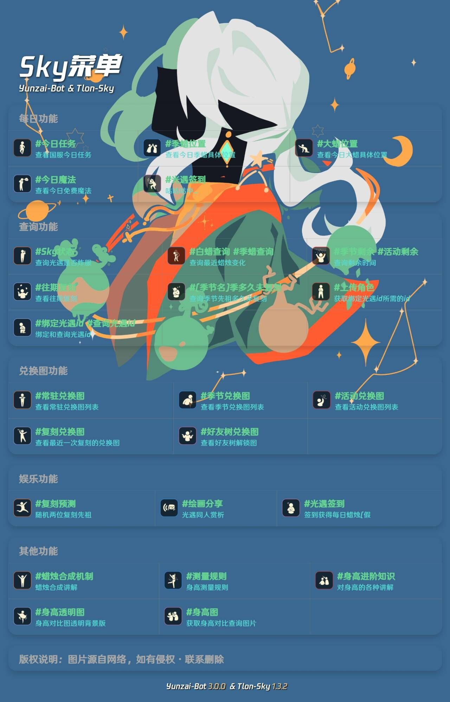

# <div align="center"><h1 align="center">Sky光遇插件<a href='https://gitee.com/Tloml-Starry/SKY-GuangYu-plugin/stargazers'></img></a></h1></div>

#### <div align="center">介绍</div>
<div align="center">

为[Yunzai-Bot V3](https://gitee.com/Le-niao/Yunzai-Bot)提供光遇相关功能

</div>

#### <div align="center">安装</div>
<div align="center">使用Gitee安装，在Yunzai-Bot根目录执行</div>

```
git clone https://gitee.com/Tloml-Starry/Tlon-Sky.git ./plugins/Tlon-Sky/
```

#### 更新

* 使用指令：Sky更新

#### 绘画分享图库安装


* 使用指令：`Sky更新图库`
* 后续更新图库同上

#### 复刻图安装

* 使用指令：`#刷新复刻`或`#更新复刻`
* 后续更新同上

#### <div align="center">功能</div>
<details>
<summary>功能列表</summary>
<p align="center">

</p>

# 图源来自网络，如有侵权，联系删除


<div align="center">

#### 开发不易

</div>

<div align="center">点个Star就是对我最大的支持!</div>
<div align="center">

 一起玩耍加群~[392665563](https://jq.qq.com/?_wv=1027&k=VQAEpAlH)

</div>

<div align="center">

#### 请我喝瓶阿萨姆~

</div>

<div align="center">

请我喝一瓶阿萨姆提供动力~☛[爱发电](https://afdian.net/a/Tloml-Starry)

</div>

<div align="center">

#### BUG反馈及优化

</div>

<div align="center">

请向本项目发起☛[lssues](https://gitee.com/Tloml-Starry/Tlon-Sky/issues/I6LRZ9)☚

</div>

☛[预告功能](https://gitee.com/Tloml-Starry/Tlon-Sky/wikis/%E9%A2%84%E5%91%8A%E5%8A%9F%E8%83%BD)


☛[鸣谢名单](https://gitee.com/Tloml-Starry/Tlon-Sky/wikis/%E9%B8%A3%E8%B0%A2%E5%90%8D%E5%8D%95)


☛[赞助名单](https://gitee.com/Tloml-Starry/Tlon-Sky/wikis/%E8%B5%9E%E5%8A%A9%E5%90%8D%E5%8D%95)