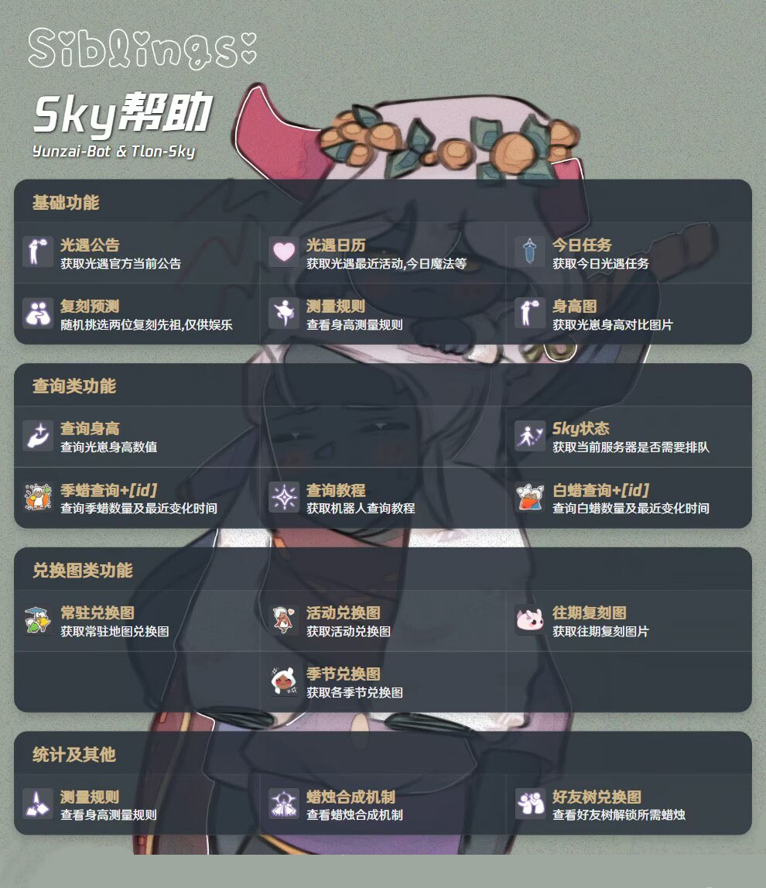

# 光遇插件<a href='https://gitee.com/Tloml-Starry/SKY-GuangYu-plugin/stargazers'></img></a>
<p align="center">

</p>

#### 介绍
为云崽提供光遇相关功能

#### 安装
使用Gitee安装
```
git clone https://gitee.com/Tloml-Starry/Tlon-Sky.git ./plugins/Tlon-Sky/
```
#### 查询光崽身高
* 您可以添加Q群[1028495728](https://jq.qq.com/?_wv=1027&k=YQ2G0IP6)使用
* 查询请私聊管理员
* 或者使用软件自助查询[身高查询软件](https://share.weiyun.com/x0dcR4m1)

#### 功能
<p align="center">

</p>
 * 代码很烂,轻喷

#### 预告功能
| 功能名称 | 说明 |
| -------| ----- |
| 蜡烛排行榜 | 对已收录玩家id进行蜡烛数量排行 |
 * 部分图源来自网络，如有侵权，联系删除

☞[鸣谢名单](./鸣谢名单.md)

☞[赞助名单](./赞助名单.md)
#### 开发不易

 * 点个Star就是对我最大的支持!
 * 一起玩耍：[392665563](https://jq.qq.com/?_wv=1027&k=VQAEpAlH)
 * 或者为我赞助提供动力[爱发电](https://afdian.net/a/Tloml-Starry)
#### BUG反馈及优化
 * 请向本项目发起☞[lssues](https://gitee.com/Tloml-Starry/Tlon-Sky/issues/I6LRZ9)