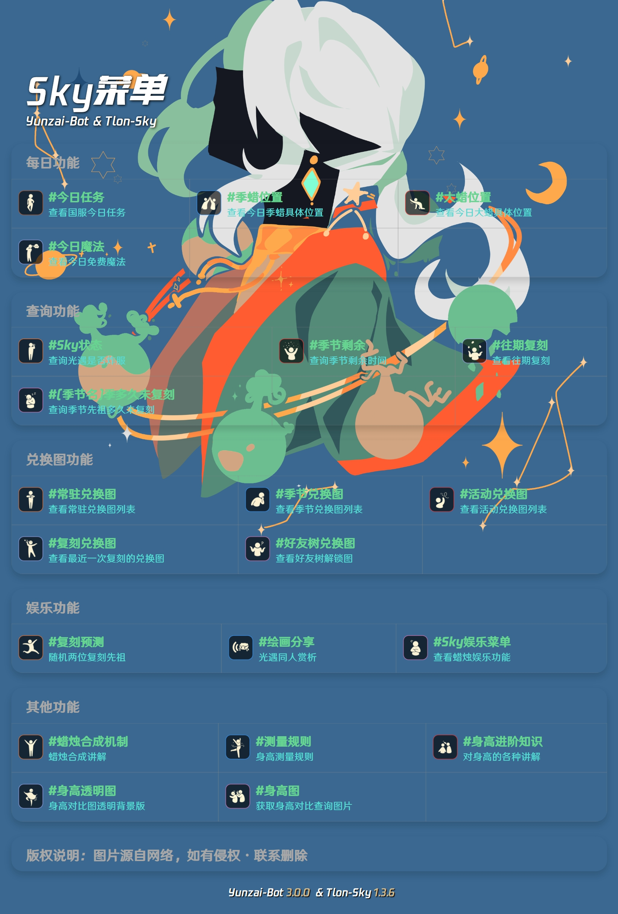

# <div align="center"><h1 align="center">Sky光遇插件<a href='https://gitee.com/Tloml-Starry/SKY-GuangYu-plugin/stargazers'></img></a></h1></div>

#### <div align="center">介绍</div>
<div align="center">

为[Yunzai-Bot V3](https://gitee.com/Le-niao/Yunzai-Bot)提供光遇相关功能

图源来自网络，如有侵权，联系删除

该插件已停止更新，后续内容请在Q群查看☛[点击加群](392665563)

</div>

#### <div align="center">安装</div>
<div align="center">使用Gitee安装，在Yunzai-Bot根目录执行</div>

```
git clone https://gitee.com/Tloml-Starry/Tlon-Sky.git ./plugins/Tlon-Sky/
```

#### 绘画分享图库安装

* 使用指令：`Sky更新图库`
* 后续更新图库同上

## 🎉功能
<details>
<summary>功能列表</summary>
<p align="center">

</p>
</details>

## 开发不易

点个Star就是对我最大的支持!

## 📞 联系
<details>
<summary>QQ：3620060826</summary>
<p align="center">

</p>
</details>

<details>
<summary>官群：392665563</summary>
<p align="center">

</p>
</details>

## BUG反馈及优化

向本项目发起☛[lssues](https://gitee.com/Tloml-Starry/Tlon-Sky/issues/I6LRZ9)