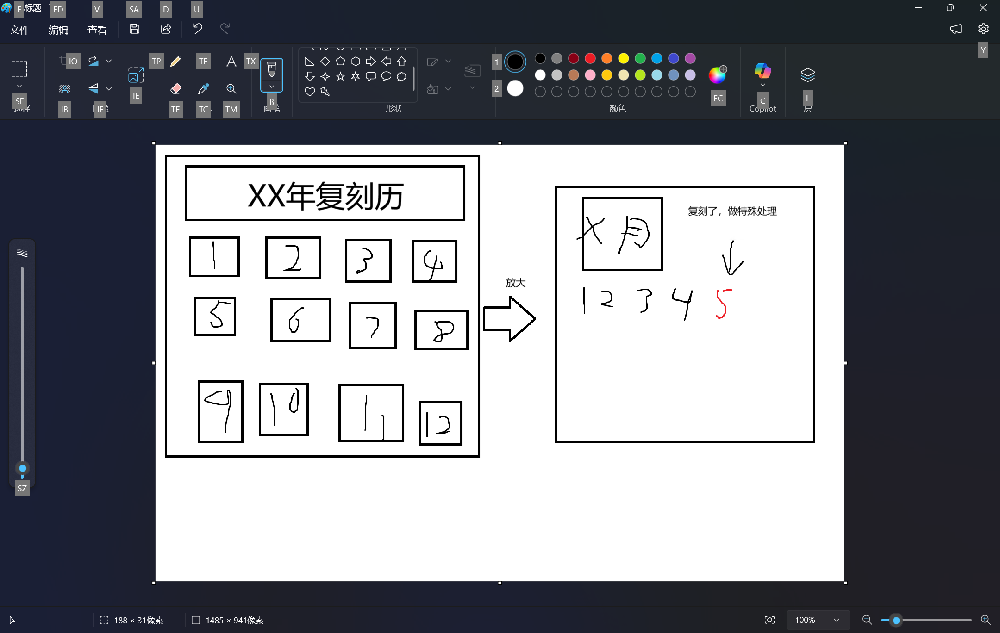

#### 复刻历
对指定的日期做特殊处理，用特殊的颜色或直接使用季节图标标注，直接展示当年所有日期

  </a>
    
  </a>

> 忽略我抽象的演示图

#### 先祖复刻详情
查询指定先祖的所有复刻日期，展示其装扮Icon等，如果可以，添加一些官方的介绍信息

```
a: xx先祖复刻记录
b: xx先祖共复刻x次
   xx年x月x日 第x此
   ....
   先祖介绍巴拉巴拉
   (应该会做成图片式的方便展示动作和装扮的icon)
```